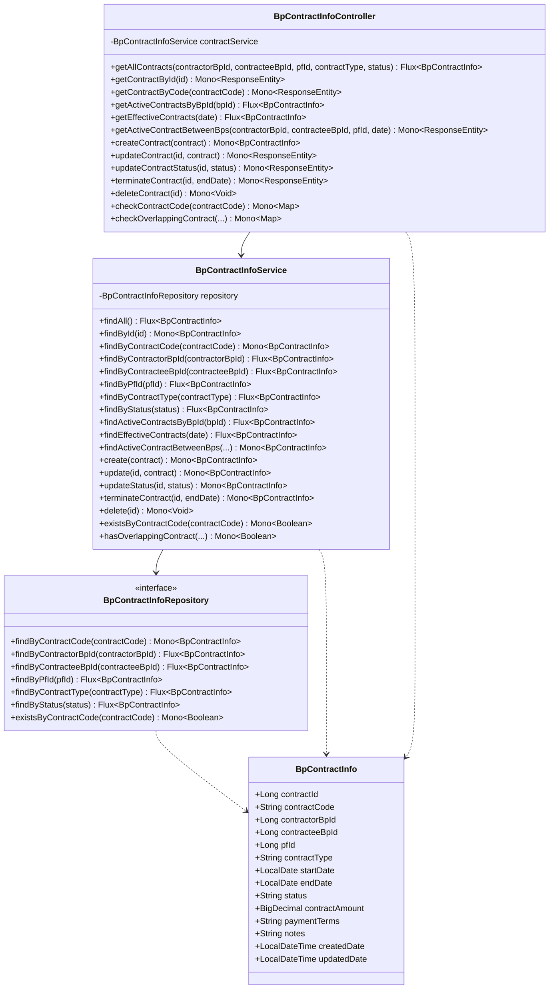
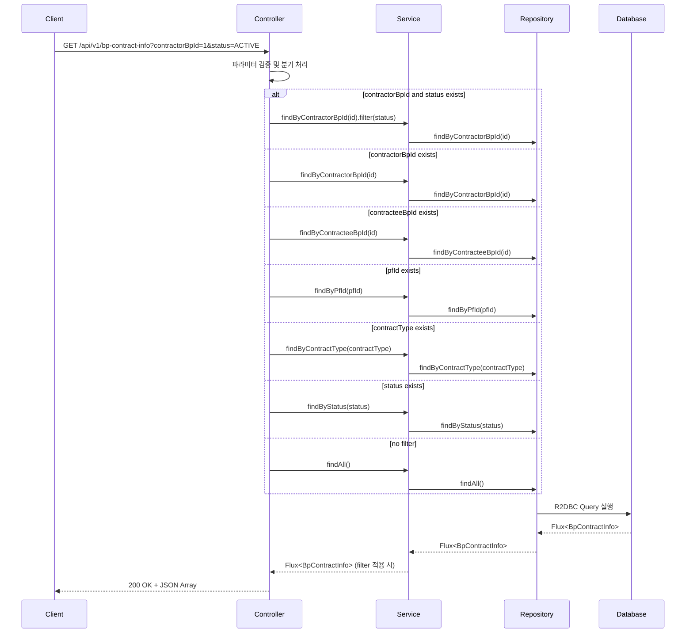
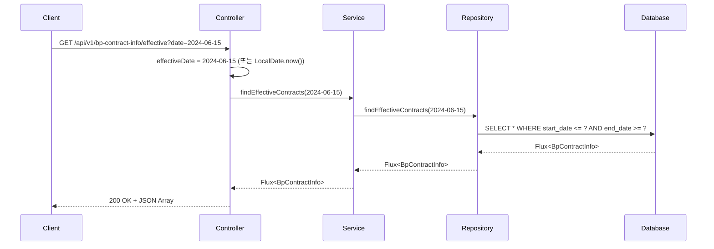
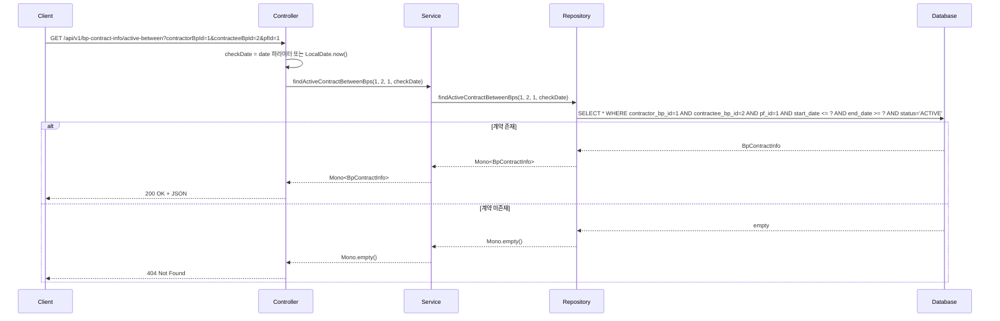
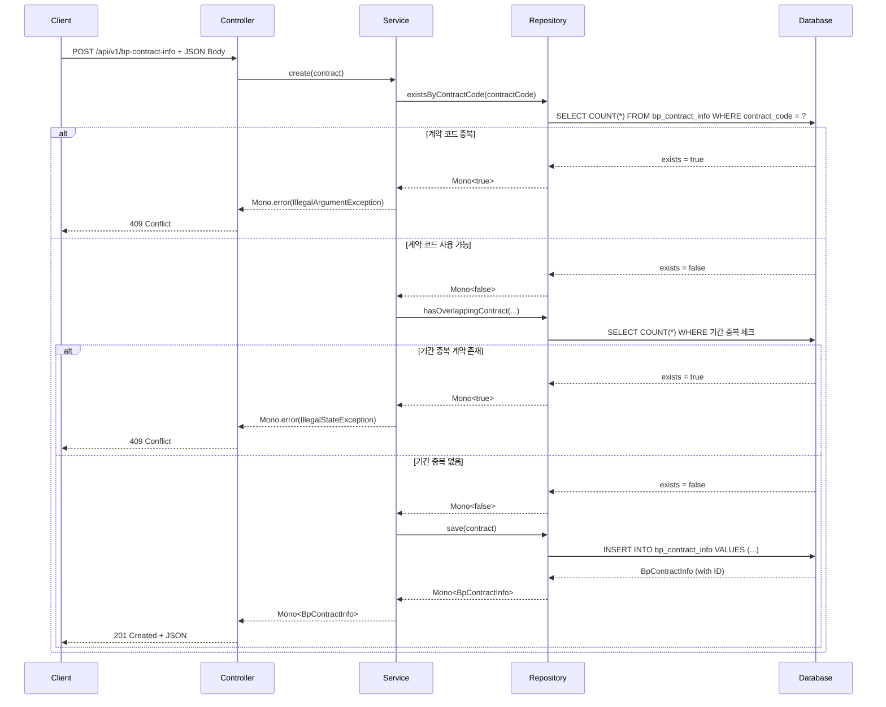
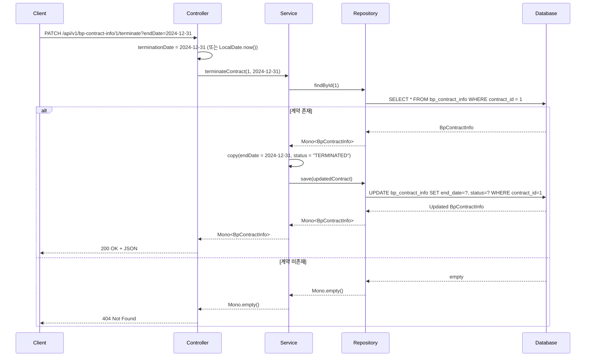

# BP Contract Info API 문서

## 개요
Business Partner Contract Information Management API - 비즈니스 파트너 간 계약 정보를 관리하는 RESTful API

**Base URL**: `/api/v1/bp-contract-info`

## 도메인 모델

### 클래스 다이어그램



## API 엔드포인트

### 1. 전체 계약 조회
**GET** `/api/v1/bp-contract-info`

계약 목록을 조회하며, 선택적 필터링 지원

#### 요청 파라미터
| 파라미터 | 타입 | 필수 | 설명 | 예시 |
|---------|------|-----|------|------|
| contractorBpId | Long | N | 계약자 BP ID 필터 | 1 |
| contracteeBpId | Long | N | 피계약자 BP ID 필터 | 2 |
| pfId | Long | N | 플랫폼 ID 필터 | 1 |
| contractType | String | N | 계약 유형 필터 | SALES, SERVICE |
| status | String | N | 상태 필터 | ACTIVE, EXPIRED, TERMINATED |

#### 응답
```json
[
  {
    "contractId": 1,
    "contractCode": "CONT001",
    "contractorBpId": 1,
    "contracteeBpId": 2,
    "pfId": 1,
    "contractType": "SALES",
    "startDate": "2024-01-01",
    "endDate": "2024-12-31",
    "status": "ACTIVE",
    "contractAmount": 10000000.00,
    "paymentTerms": "Monthly payment on the 25th",
    "notes": "Initial contract with standard terms",
    "createdDate": "2023-12-15T10:00:00",
    "updatedDate": "2024-01-01T09:00:00"
  }
]
```

#### API 흐름도


---

### 2. ID로 계약 조회
**GET** `/api/v1/bp-contract-info/{id}`

특정 계약 ID로 단일 계약 조회

#### 경로 파라미터
| 파라미터 | 타입 | 필수 | 설명 |
|---------|------|-----|------|
| id | Long | Y | 계약 고유 ID |

#### 응답
- **200 OK**: 계약 정보 반환
- **404 Not Found**: 계약 미존재

---

### 3. 계약 코드로 조회
**GET** `/api/v1/bp-contract-info/code/{contractCode}`

계약 코드로 단일 계약 조회

#### 경로 파라미터
| 파라미터 | 타입 | 필수 | 설명 |
|---------|------|-----|------|
| contractCode | String | Y | 계약 코드 |

---

### 4. BP의 활성 계약 조회
**GET** `/api/v1/bp-contract-info/active/by-bp/{bpId}`

특정 BP의 활성 상태 계약만 조회

#### 경로 파라미터
| 파라미터 | 타입 | 필수 | 설명 |
|---------|------|-----|------|
| bpId | Long | Y | BP ID |

---

### 5. 특정 날짜 유효한 계약 조회
**GET** `/api/v1/bp-contract-info/effective`

특정 날짜 기준으로 유효한 계약 조회

#### 요청 파라미터
| 파라미터 | 타입 | 필수 | 설명 | 기본값 |
|---------|------|-----|------|-------|
| date | LocalDate (ISO) | N | 조회 기준 날짜 | 오늘 |

#### API 흐름도


---

### 6. BP 간 활성 계약 조회
**GET** `/api/v1/bp-contract-info/active-between`

두 BP 간 특정 플랫폼에서의 활성 계약 조회

#### 요청 파라미터
| 파라미터 | 타입 | 필수 | 설명 | 기본값 |
|---------|------|-----|------|-------|
| contractorBpId | Long | Y | 계약자 BP ID | - |
| contracteeBpId | Long | Y | 피계약자 BP ID | - |
| pfId | Long | Y | 플랫폼 ID | - |
| date | LocalDate (ISO) | N | 조회 기준 날짜 | 오늘 |

#### 응답
- **200 OK**: 활성 계약 정보 반환
- **404 Not Found**: 활성 계약 미존재

#### API 흐름도


---

### 7. 계약 생성
**POST** `/api/v1/bp-contract-info`

새로운 계약 생성

#### 요청 바디
```json
{
  "contractCode": "CONT002",
  "contractorBpId": 1,
  "contracteeBpId": 3,
  "pfId": 1,
  "contractType": "SERVICE",
  "startDate": "2024-07-01",
  "endDate": "2025-06-30",
  "status": "ACTIVE",
  "contractAmount": 5000000.00,
  "paymentTerms": "Quarterly payment",
  "notes": "Service contract for platform management"
}
```

#### 응답
- **201 Created**: 계약 생성 성공
- **400 Bad Request**: 잘못된 요청 데이터
- **409 Conflict**: 계약 코드 중복 또는 기간 중복

#### API 흐름도


---

### 8. 계약 수정
**PUT** `/api/v1/bp-contract-info/{id}`

기존 계약 정보 수정

#### 경로 파라미터
| 파라미터 | 타입 | 필수 | 설명 |
|---------|------|-----|------|
| id | Long | Y | 계약 고유 ID |

---

### 9. 계약 상태 변경
**PATCH** `/api/v1/bp-contract-info/{id}/status`

계약 상태만 변경 (ACTIVE, EXPIRED, TERMINATED)

#### 경로 파라미터
| 파라미터 | 타입 | 필수 | 설명 |
|---------|------|-----|------|
| id | Long | Y | 계약 고유 ID |

#### 요청 파라미터
| 파라미터 | 타입 | 필수 | 설명 | 예시 |
|---------|------|-----|------|------|
| status | String | Y | 새로운 상태 | ACTIVE |

---

### 10. 계약 종료 처리
**PATCH** `/api/v1/bp-contract-info/{id}/terminate`

계약 종료 처리 (상태 변경 + 종료일 설정)

#### 경로 파라미터
| 파라미터 | 타입 | 필수 | 설명 |
|---------|------|-----|------|
| id | Long | Y | 계약 고유 ID |

#### 요청 파라미터
| 파라미터 | 타입 | 필수 | 설명 | 기본값 |
|---------|------|-----|------|-------|
| endDate | LocalDate (ISO) | N | 종료일 | 오늘 |

#### API 흐름도


---

### 11. 계약 삭제
**DELETE** `/api/v1/bp-contract-info/{id}`

계약 삭제 (영구 삭제)

#### 경로 파라미터
| 파라미터 | 타입 | 필수 | 설명 |
|---------|------|-----|------|
| id | Long | Y | 계약 고유 ID |

#### 응답
- **204 No Content**: 삭제 성공
- **404 Not Found**: 계약 미존재

---

### 12. 계약 코드 중복 체크
**GET** `/api/v1/bp-contract-info/check/code/{contractCode}`

계약 코드 중복 여부 확인

#### 경로 파라미터
| 파라미터 | 타입 | 필수 | 설명 | 예시 |
|---------|------|-----|------|------|
| contractCode | String | Y | 계약 코드 | CONT001 |

#### 응답
```json
{
  "exists": true
}
```

---

### 13. 계약 기간 중복 체크
**GET** `/api/v1/bp-contract-info/check/overlapping`

특정 BP 간 계약 기간 중복 여부 확인

#### 요청 파라미터
| 파라미터 | 타입 | 필수 | 설명 | 예시 |
|---------|------|-----|------|------|
| contractorBpId | Long | Y | 계약자 BP ID | 1 |
| contracteeBpId | Long | Y | 피계약자 BP ID | 2 |
| pfId | Long | Y | 플랫폼 ID | 1 |
| startDate | LocalDate (ISO) | Y | 계약 시작일 | 2024-01-01 |
| endDate | LocalDate (ISO) | Y | 계약 종료일 | 2024-12-31 |

#### 응답
```json
{
  "hasOverlapping": false
}
```

## 에러 응답

### 공통 에러 코드
| HTTP 상태 | 설명 |
|----------|------|
| 400 Bad Request | 잘못된 요청 데이터 |
| 404 Not Found | 리소스 미존재 |
| 409 Conflict | 데이터 충돌 (중복, 기간 중복 등) |
| 500 Internal Server Error | 서버 내부 오류 |

## 비즈니스 규칙

1. **계약 코드 고유성**: `contractCode`는 시스템 전체에서 고유해야 함
2. **양 당사자 필수**: `contractorBpId`와 `contracteeBpId` 모두 필수
3. **플랫폼 연관**: 모든 계약은 특정 플랫폼(`pfId`)에 속해야 함
4. **기간 제약**: `endDate`는 `startDate` 이후 날짜여야 함
5. **기간 중복 방지**: 동일한 BP 간 동일 플랫폼에서 기간이 중복되는 계약 생성 불가
6. **상태 값**: ACTIVE, EXPIRED, TERMINATED 중 하나만 허용
7. **삭제 제약**: 거래 이력이 있는 계약은 삭제 불가 (종료 처리 권장)

## 사용 예시

### cURL 예시

```bash
# 계약자 BP의 활성 계약 조회
curl -X GET "http://localhost:8080/api/v1/bp-contract-info?contractorBpId=1&status=ACTIVE"

# 특정 날짜 유효한 계약 조회
curl -X GET "http://localhost:8080/api/v1/bp-contract-info/effective?date=2024-06-15"

# BP 간 활성 계약 조회
curl -X GET "http://localhost:8080/api/v1/bp-contract-info/active-between?contractorBpId=1&contracteeBpId=2&pfId=1"

# 계약 생성
curl -X POST "http://localhost:8080/api/v1/bp-contract-info" \
  -H "Content-Type: application/json" \
  -d '{
    "contractCode": "CONT002",
    "contractorBpId": 1,
    "contracteeBpId": 3,
    "pfId": 1,
    "contractType": "SERVICE",
    "startDate": "2024-07-01",
    "endDate": "2025-06-30",
    "status": "ACTIVE",
    "contractAmount": 5000000.00,
    "paymentTerms": "Quarterly payment"
  }'

# 계약 종료 처리
curl -X PATCH "http://localhost:8080/api/v1/bp-contract-info/1/terminate?endDate=2024-12-31"

# 계약 기간 중복 체크
curl -X GET "http://localhost:8080/api/v1/bp-contract-info/check/overlapping?contractorBpId=1&contracteeBpId=2&pfId=1&startDate=2024-01-01&endDate=2024-12-31"
```

## 관련 도메인

- **BpMaster**: 계약 당사자인 비즈니스 파트너 정보
- **PfCodeMaster**: 계약이 속한 플랫폼 정보