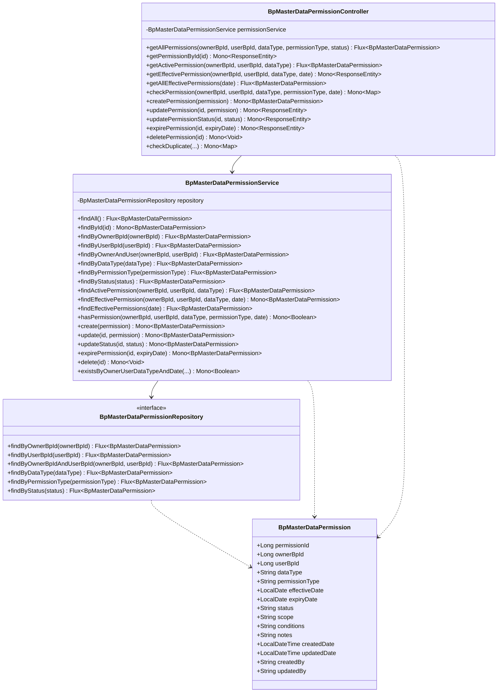
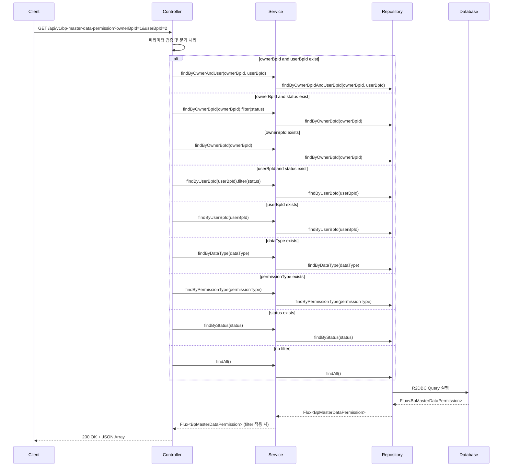
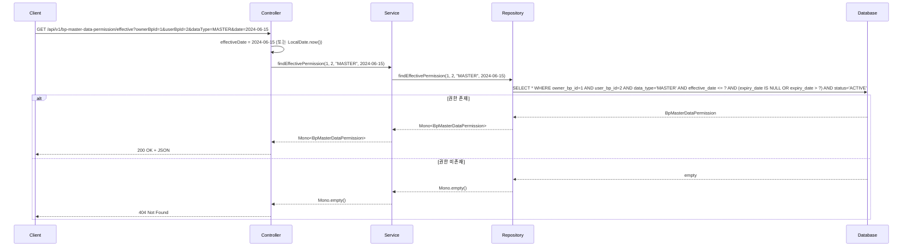
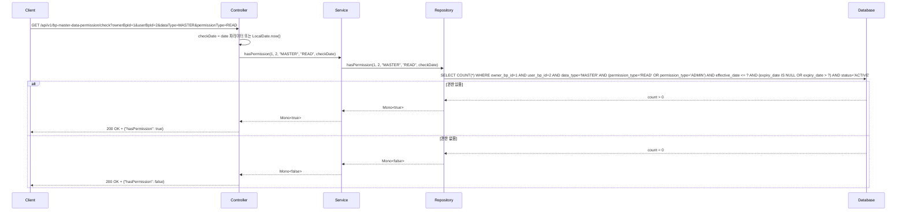
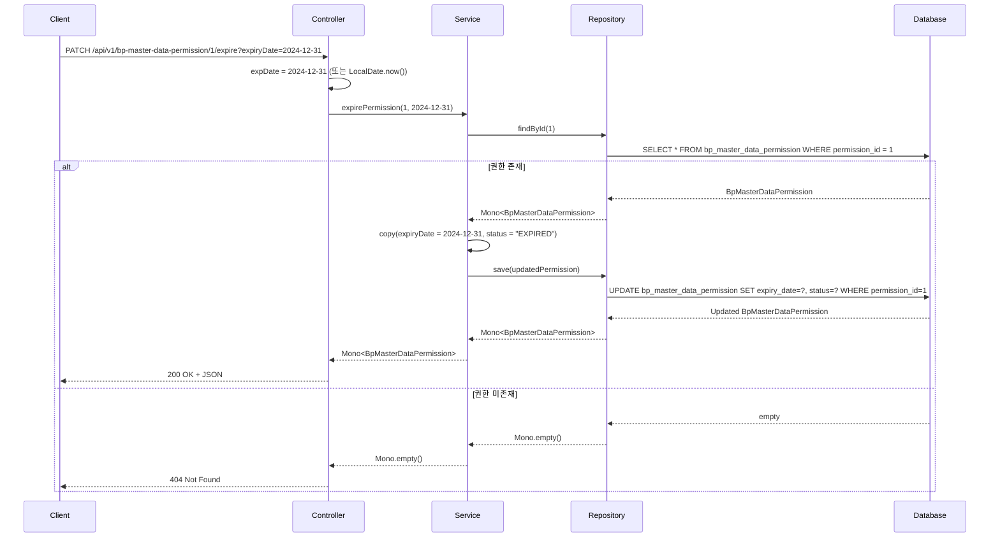

# BP Master Data Permission API 문서

## 개요
Business Partner Master Data Permission Management API - 비즈니스 파트너 간 마스터 데이터 권한을 관리하는 RESTful API

**Base URL**: `/api/v1/bp-master-data-permission`

## 도메인 모델

### 클래스 다이어그램



## API 엔드포인트

### 1. 전체 권한 조회
**GET** `/api/v1/bp-master-data-permission`

권한 목록을 조회하며, 선택적 필터링 지원

#### 요청 파라미터
| 파라미터 | 타입 | 필수 | 설명 | 예시 |
|---------|------|-----|------|------|
| ownerBpId | Long | N | 소유자 BP ID 필터 | 1 |
| userBpId | Long | N | 사용자 BP ID 필터 | 2 |
| dataType | String | N | 데이터 유형 필터 | MASTER, STORE, CONTRACT |
| permissionType | String | N | 권한 유형 필터 | READ, WRITE, ADMIN |
| status | String | N | 상태 필터 | ACTIVE, EXPIRED |

#### 응답
```json
[
  {
    "permissionId": 1,
    "ownerBpId": 1,
    "userBpId": 2,
    "dataType": "MASTER",
    "permissionType": "READ",
    "effectiveDate": "2024-01-01",
    "expiryDate": "2024-12-31",
    "status": "ACTIVE",
    "scope": "ALL",
    "conditions": null,
    "notes": "Read access to master data",
    "createdDate": "2023-12-25T10:00:00",
    "updatedDate": "2024-01-01T09:00:00",
    "createdBy": "admin",
    "updatedBy": "admin"
  }
]
```

#### API 흐름도


---

### 2. ID로 권한 조회
**GET** `/api/v1/bp-master-data-permission/{id}`

특정 권한 ID로 단일 권한 조회

#### 경로 파라미터
| 파라미터 | 타입 | 필수 | 설명 |
|---------|------|-----|------|
| id | Long | Y | 권한 고유 ID |

#### 응답
- **200 OK**: 권한 정보 반환
- **404 Not Found**: 권한 미존재

---

### 3. 활성 권한 조회
**GET** `/api/v1/bp-master-data-permission/active`

특정 BP 간 특정 데이터 유형의 활성 권한 조회

#### 요청 파라미터
| 파라미터 | 타입 | 필수 | 설명 | 예시 |
|---------|------|-----|------|------|
| ownerBpId | Long | Y | 소유자 BP ID | 1 |
| userBpId | Long | Y | 사용자 BP ID | 2 |
| dataType | String | Y | 데이터 유형 | MASTER |

---

### 4. 특정 날짜 유효한 권한 조회
**GET** `/api/v1/bp-master-data-permission/effective`

특정 날짜 기준으로 유효한 권한 조회

#### 요청 파라미터
| 파라미터 | 타입 | 필수 | 설명 | 기본값 |
|---------|------|-----|------|-------|
| ownerBpId | Long | Y | 소유자 BP ID | - |
| userBpId | Long | Y | 사용자 BP ID | - |
| dataType | String | Y | 데이터 유형 | - |
| date | LocalDate (ISO) | N | 조회 기준 날짜 | 오늘 |

#### 응답
- **200 OK**: 유효한 권한 정보 반환
- **404 Not Found**: 유효한 권한 미존재

#### API 흐름도


---

### 5. 특정 날짜 유효한 모든 권한 조회
**GET** `/api/v1/bp-master-data-permission/effective/all`

특정 날짜 기준으로 시스템 전체의 유효한 권한 조회

#### 요청 파라미터
| 파라미터 | 타입 | 필수 | 설명 | 기본값 |
|---------|------|-----|------|-------|
| date | LocalDate (ISO) | N | 조회 기준 날짜 | 오늘 |

---

### 6. 권한 체크
**GET** `/api/v1/bp-master-data-permission/check`

특정 BP가 특정 데이터에 대한 권한을 가지고 있는지 확인

#### 요청 파라미터
| 파라미터 | 타입 | 필수 | 설명 | 기본값 |
|---------|------|-----|------|-------|
| ownerBpId | Long | Y | 소유자 BP ID | - |
| userBpId | Long | Y | 사용자 BP ID | - |
| dataType | String | Y | 데이터 유형 | - |
| permissionType | String | Y | 권한 유형 | - |
| date | LocalDate (ISO) | N | 조회 기준 날짜 | 오늘 |

#### 응답
```json
{
  "hasPermission": true
}
```

#### API 흐름도


---

### 7. 권한 생성
**POST** `/api/v1/bp-master-data-permission`

새로운 권한 생성

#### 요청 바디
```json
{
  "ownerBpId": 1,
  "userBpId": 3,
  "dataType": "STORE",
  "permissionType": "WRITE",
  "effectiveDate": "2024-07-01",
  "expiryDate": "2025-06-30",
  "status": "ACTIVE",
  "scope": "REGIONAL",
  "conditions": "region='SEOUL'",
  "notes": "Write access to store data in Seoul region"
}
```

#### 응답
- **201 Created**: 권한 생성 성공
- **400 Bad Request**: 잘못된 요청 데이터
- **409 Conflict**: 권한 중복

---

### 8. 권한 수정
**PUT** `/api/v1/bp-master-data-permission/{id}`

기존 권한 정보 수정

#### 경로 파라미터
| 파라미터 | 타입 | 필수 | 설명 |
|---------|------|-----|------|
| id | Long | Y | 권한 고유 ID |

---

### 9. 권한 상태 변경
**PATCH** `/api/v1/bp-master-data-permission/{id}/status`

권한 상태만 변경

#### 경로 파라미터
| 파라미터 | 타입 | 필수 | 설명 |
|---------|------|-----|------|
| id | Long | Y | 권한 고유 ID |

#### 요청 파라미터
| 파라미터 | 타입 | 필수 | 설명 | 예시 |
|---------|------|-----|------|------|
| status | String | Y | 새로운 상태 | ACTIVE, EXPIRED, SUSPENDED |

---

### 10. 권한 만료 처리
**PATCH** `/api/v1/bp-master-data-permission/{id}/expire`

권한 만료 처리 (상태 변경 + 만료일 설정)

#### 경로 파라미터
| 파라미터 | 타입 | 필수 | 설명 |
|---------|------|-----|------|
| id | Long | Y | 권한 고유 ID |

#### 요청 파라미터
| 파라미터 | 타입 | 필수 | 설명 | 기본값 |
|---------|------|-----|------|-------|
| expiryDate | LocalDate (ISO) | N | 만료일 | 오늘 |

#### API 흐름도


---

### 11. 권한 삭제
**DELETE** `/api/v1/bp-master-data-permission/{id}`

권한 삭제 (영구 삭제)

#### 경로 파라미터
| 파라미터 | 타입 | 필수 | 설명 |
|---------|------|-----|------|
| id | Long | Y | 권한 고유 ID |

#### 응답
- **204 No Content**: 삭제 성공
- **404 Not Found**: 권한 미존재

---

### 12. 권한 중복 체크
**GET** `/api/v1/bp-master-data-permission/check/duplicate`

특정 조건의 권한 중복 여부 확인

#### 요청 파라미터
| 파라미터 | 타입 | 필수 | 설명 | 예시 |
|---------|------|-----|------|------|
| ownerBpId | Long | Y | 소유자 BP ID | 1 |
| userBpId | Long | Y | 사용자 BP ID | 2 |
| dataType | String | Y | 데이터 유형 | MASTER |
| effectiveDate | LocalDate (ISO) | Y | 유효 날짜 | 2024-01-01 |

#### 응답
```json
{
  "exists": false
}
```

## 에러 응답

### 공통 에러 코드
| HTTP 상태 | 설명 |
|----------|------|
| 400 Bad Request | 잘못된 요청 데이터 |
| 404 Not Found | 리소스 미존재 |
| 409 Conflict | 데이터 충돌 (중복 등) |
| 500 Internal Server Error | 서버 내부 오류 |

## 비즈니스 규칙

1. **소유자-사용자 필수**: `ownerBpId`와 `userBpId` 모두 필수
2. **데이터 유형**: MASTER, STORE, CONTRACT 등 사전 정의된 값만 허용
3. **권한 유형 계층**: ADMIN > WRITE > READ (상위 권한은 하위 권한 포함)
4. **유효 날짜 필수**: `effectiveDate`는 필수이며, 미래 날짜 가능
5. **만료일 제약**: `expiryDate`는 `effectiveDate` 이후 날짜만 허용
6. **중복 방지**: 동일한 Owner-User-DataType 조합에 대해 기간이 중복되는 권한 생성 불가
7. **상태 값**: ACTIVE, EXPIRED, SUSPENDED 중 하나만 허용
8. **스코프**: ALL, REGIONAL, SPECIFIC 등 사전 정의된 값만 허용
9. **삭제 제약**: 활성 상태의 권한은 만료 처리 후 삭제 권장

## 사용 예시

### cURL 예시

```bash
# Owner BP의 권한 조회
curl -X GET "http://localhost:8080/api/v1/bp-master-data-permission?ownerBpId=1"

# 활성 권한 조회
curl -X GET "http://localhost:8080/api/v1/bp-master-data-permission/active?ownerBpId=1&userBpId=2&dataType=MASTER"

# 특정 날짜 유효한 권한 조회
curl -X GET "http://localhost:8080/api/v1/bp-master-data-permission/effective?ownerBpId=1&userBpId=2&dataType=MASTER&date=2024-06-15"

# 권한 체크
curl -X GET "http://localhost:8080/api/v1/bp-master-data-permission/check?ownerBpId=1&userBpId=2&dataType=MASTER&permissionType=READ"

# 권한 생성
curl -X POST "http://localhost:8080/api/v1/bp-master-data-permission" \
  -H "Content-Type: application/json" \
  -d '{
    "ownerBpId": 1,
    "userBpId": 3,
    "dataType": "STORE",
    "permissionType": "WRITE",
    "effectiveDate": "2024-07-01",
    "expiryDate": "2025-06-30",
    "status": "ACTIVE",
    "scope": "REGIONAL"
  }'

# 권한 만료 처리
curl -X PATCH "http://localhost:8080/api/v1/bp-master-data-permission/1/expire?expiryDate=2024-12-31"

# 권한 중복 체크
curl -X GET "http://localhost:8080/api/v1/bp-master-data-permission/check/duplicate?ownerBpId=1&userBpId=2&dataType=MASTER&effectiveDate=2024-07-01"
```

## 관련 도메인

- **BpMaster**: 권한의 소유자 및 사용자인 비즈니스 파트너 정보
- **BpStoreInfo**: 권한 대상이 되는 매장 정보
- **BpContractInfo**: 권한 대상이 되는 계약 정보