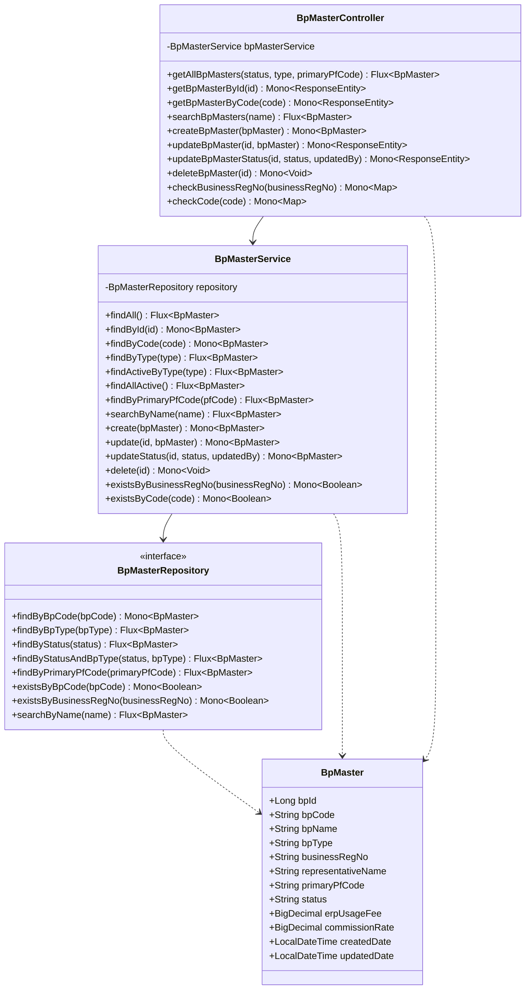
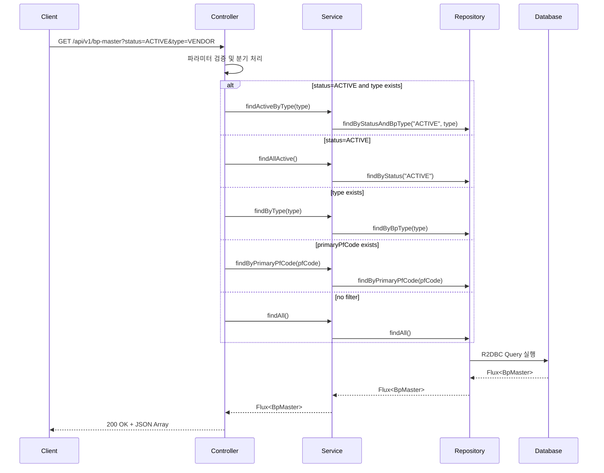
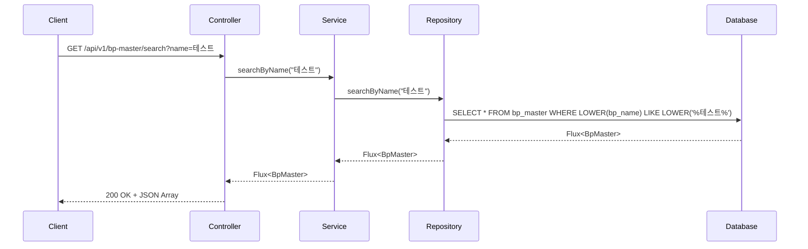
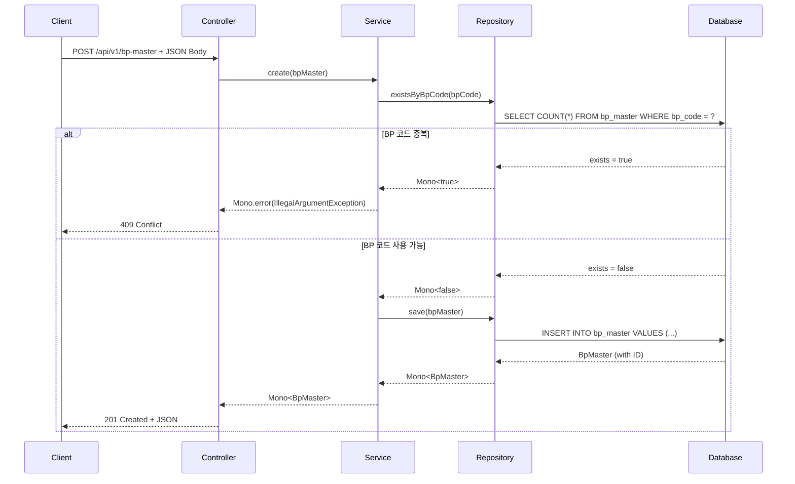
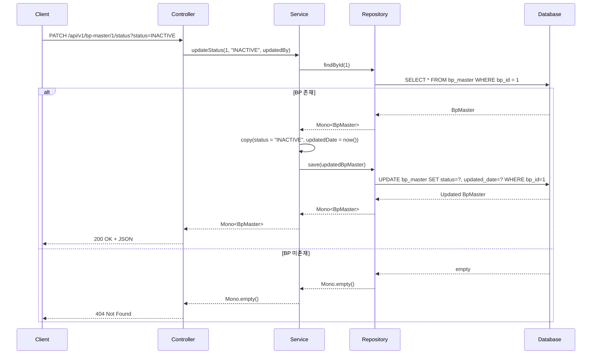

# BP Master API 문서

## 개요
Business Partner Master Data Management API - 비즈니스 파트너 마스터 데이터를 관리하는 RESTful API

**Base URL**: `/api/v1/bp-master`

## 도메인 모델

### 클래스 다이어그램



## API 엔드포인트

### 1. 전체 BP 조회
**GET** `/api/v1/bp-master`

비즈니스 파트너 목록을 조회하며, 선택적 필터링 지원

#### 요청 파라미터
| 파라미터 | 타입 | 필수 | 설명 | 예시 |
|---------|------|-----|------|------|
| status | String | N | 상태 필터 | ACTIVE, INACTIVE |
| type | String | N | BP 유형 필터 | VENDOR, CUSTOMER |
| primaryPfCode | String | N | 주 플랫폼 코드 필터 | PF001 |

#### 응답
```json
[
  {
    "bpId": 1,
    "bpCode": "BP001",
    "bpName": "테스트 파트너",
    "bpType": "VENDOR",
    "businessRegNo": "123-45-67890",
    "representativeName": "홍길동",
    "primaryPfCode": "PF001",
    "status": "ACTIVE",
    "erpUsageFee": 100000.00,
    "commissionRate": 3.5,
    "createdDate": "2024-01-01T10:00:00",
    "updatedDate": "2024-01-15T14:30:00"
  }
]
```

#### API 흐름도


---

### 2. ID로 BP 조회
**GET** `/api/v1/bp-master/{id}`

특정 BP ID로 단일 비즈니스 파트너 조회

#### 경로 파라미터
| 파라미터 | 타입 | 필수 | 설명 |
|---------|------|-----|------|
| id | Long | Y | BP 고유 ID |

#### 응답
- **200 OK**: BP 정보 반환
- **404 Not Found**: BP 미존재

```json
{
  "bpId": 1,
  "bpCode": "BP001",
  "bpName": "테스트 파트너",
  "bpType": "VENDOR",
  "businessRegNo": "123-45-67890",
  "representativeName": "홍길동",
  "primaryPfCode": "PF001",
  "status": "ACTIVE",
  "erpUsageFee": 100000.00,
  "commissionRate": 3.5,
  "createdDate": "2024-01-01T10:00:00",
  "updatedDate": "2024-01-15T14:30:00"
}
```

---

### 3. 코드로 BP 조회
**GET** `/api/v1/bp-master/code/{code}`

BP 코드로 단일 비즈니스 파트너 조회

#### 경로 파라미터
| 파라미터 | 타입 | 필수 | 설명 |
|---------|------|-----|------|
| code | String | Y | BP 코드 (고유값) |

#### 응답
- **200 OK**: BP 정보 반환
- **404 Not Found**: BP 미존재

---

### 4. 이름으로 BP 검색
**GET** `/api/v1/bp-master/search`

BP 이름으로 부분 일치 검색

#### 요청 파라미터
| 파라미터 | 타입 | 필수 | 설명 | 예시 |
|---------|------|-----|------|------|
| name | String | Y | 검색할 BP 이름 | 테스트 |

#### 응답
```json
[
  {
    "bpId": 1,
    "bpCode": "BP001",
    "bpName": "테스트 파트너",
    ...
  }
]
```

#### API 흐름도


---

### 5. BP 생성
**POST** `/api/v1/bp-master`

새로운 비즈니스 파트너 생성

#### 요청 바디
```json
{
  "bpCode": "BP002",
  "bpName": "신규 파트너",
  "bpType": "VENDOR",
  "businessRegNo": "987-65-43210",
  "representativeName": "김철수",
  "primaryPfCode": "PF001",
  "status": "ACTIVE",
  "erpUsageFee": 150000.00,
  "commissionRate": 4.0
}
```

#### 응답
- **201 Created**: BP 생성 성공
- **400 Bad Request**: 잘못된 요청 데이터
- **409 Conflict**: BP 코드 중복

#### API 흐름도


---

### 6. BP 수정
**PUT** `/api/v1/bp-master/{id}`

기존 비즈니스 파트너 정보 수정

#### 경로 파라미터
| 파라미터 | 타입 | 필수 | 설명 |
|---------|------|-----|------|
| id | Long | Y | BP 고유 ID |

#### 요청 바디
```json
{
  "bpCode": "BP001",
  "bpName": "수정된 파트너명",
  "bpType": "VENDOR",
  "businessRegNo": "123-45-67890",
  "representativeName": "홍길동",
  "primaryPfCode": "PF001",
  "status": "ACTIVE",
  "erpUsageFee": 200000.00,
  "commissionRate": 5.0
}
```

#### 응답
- **200 OK**: BP 수정 성공
- **400 Bad Request**: 잘못된 요청 데이터
- **404 Not Found**: BP 미존재
- **409 Conflict**: 기존 데이터와 충돌

---

### 7. BP 상태 변경
**PATCH** `/api/v1/bp-master/{id}/status`

BP 상태만 변경 (ACTIVE, INACTIVE, SUSPENDED)

#### 경로 파라미터
| 파라미터 | 타입 | 필수 | 설명 |
|---------|------|-----|------|
| id | Long | Y | BP 고유 ID |

#### 요청 파라미터
| 파라미터 | 타입 | 필수 | 설명 | 예시 |
|---------|------|-----|------|------|
| status | String | Y | 새로운 상태 | ACTIVE |
| updatedBy | String | N | 수정자 | admin |

#### 응답
- **200 OK**: 상태 변경 성공
- **400 Bad Request**: 잘못된 상태 값
- **404 Not Found**: BP 미존재

#### API 흐름도


---

### 8. BP 삭제
**DELETE** `/api/v1/bp-master/{id}`

비즈니스 파트너 삭제 (영구 삭제)

#### 경로 파라미터
| 파라미터 | 타입 | 필수 | 설명 |
|---------|------|-----|------|
| id | Long | Y | BP 고유 ID |

#### 응답
- **204 No Content**: 삭제 성공
- **404 Not Found**: BP 미존재
- **409 Conflict**: 의존 관계가 있어 삭제 불가

---

### 9. 사업자등록번호 중복 체크
**GET** `/api/v1/bp-master/check/business-reg-no/{businessRegNo}`

사업자등록번호 중복 여부 확인

#### 경로 파라미터
| 파라미터 | 타입 | 필수 | 설명 | 예시 |
|---------|------|-----|------|------|
| businessRegNo | String | Y | 사업자등록번호 | 123-45-67890 |

#### 응답
```json
{
  "exists": false
}
```

---

### 10. BP 코드 중복 체크
**GET** `/api/v1/bp-master/check/code/{code}`

BP 코드 중복 여부 확인

#### 경로 파라미터
| 파라미터 | 타입 | 필수 | 설명 | 예시 |
|---------|------|-----|------|------|
| code | String | Y | BP 코드 | BP001 |

#### 응답
```json
{
  "exists": true
}
```

## 에러 응답

### 공통 에러 코드
| HTTP 상태 | 설명 |
|----------|------|
| 400 Bad Request | 잘못된 요청 데이터 |
| 404 Not Found | 리소스 미존재 |
| 409 Conflict | 데이터 충돌 (중복 등) |
| 500 Internal Server Error | 서버 내부 오류 |

### 에러 응답 예시
```json
{
  "timestamp": "2024-01-01T10:00:00",
  "status": 409,
  "error": "Conflict",
  "message": "BP Code already exists: BP001",
  "path": "/api/v1/bp-master"
}
```

## 비즈니스 규칙

1. **BP 코드 고유성**: `bpCode`는 시스템 전체에서 고유해야 함
2. **사업자등록번호 고유성**: `businessRegNo`는 시스템 전체에서 고유해야 함
3. **상태 값**: ACTIVE, INACTIVE, SUSPENDED 중 하나만 허용
4. **BP 유형**: VENDOR, CUSTOMER 등 사전 정의된 값만 허용
5. **삭제 제약**: 다른 엔티티(계약, 매장 등)에서 참조 중인 BP는 삭제 불가

## 반응형 프로그래밍 패턴

이 API는 Spring WebFlux와 R2DBC를 사용한 반응형 패턴을 따릅니다:

- **Mono<T>**: 0-1개의 결과를 비동기로 반환
- **Flux<T>**: 0-N개의 결과를 비동기 스트림으로 반환
- **논블로킹**: 모든 I/O 작업은 비동기로 처리되며 스레드를 차단하지 않음

## 사용 예시

### cURL 예시

```bash
# 전체 BP 조회
curl -X GET "http://localhost:8080/api/v1/bp-master"

# 활성 VENDOR BP 조회
curl -X GET "http://localhost:8080/api/v1/bp-master?status=ACTIVE&type=VENDOR"

# BP 생성
curl -X POST "http://localhost:8080/api/v1/bp-master" \
  -H "Content-Type: application/json" \
  -d '{
    "bpCode": "BP002",
    "bpName": "신규 파트너",
    "bpType": "VENDOR",
    "businessRegNo": "987-65-43210",
    "representativeName": "김철수",
    "primaryPfCode": "PF001",
    "status": "ACTIVE"
  }'

# BP 상태 변경
curl -X PATCH "http://localhost:8080/api/v1/bp-master/1/status?status=INACTIVE"

# BP 코드 중복 체크
curl -X GET "http://localhost:8080/api/v1/bp-master/check/code/BP001"
```

## 관련 도메인

- **BpContractInfo**: BP 간 계약 정보 관리
- **BpStoreInfo**: BP 소속 매장 정보 관리
- **BpPfMapping**: BP와 플랫폼(PF) 간 매핑 관계
- **BpMasterDataPermission**: BP 마스터 데이터 권한 관리
- **PfCodeMaster**: 플랫폼 코드 마스터 관리