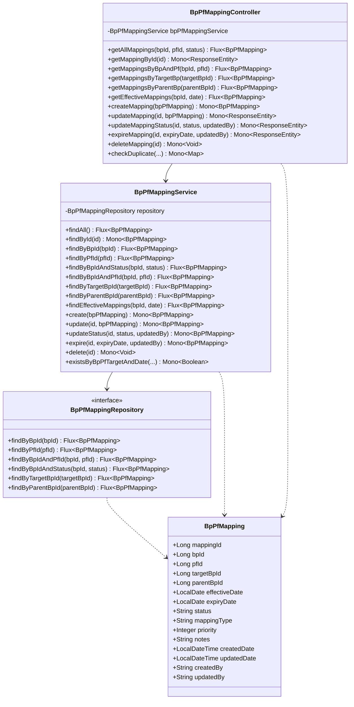
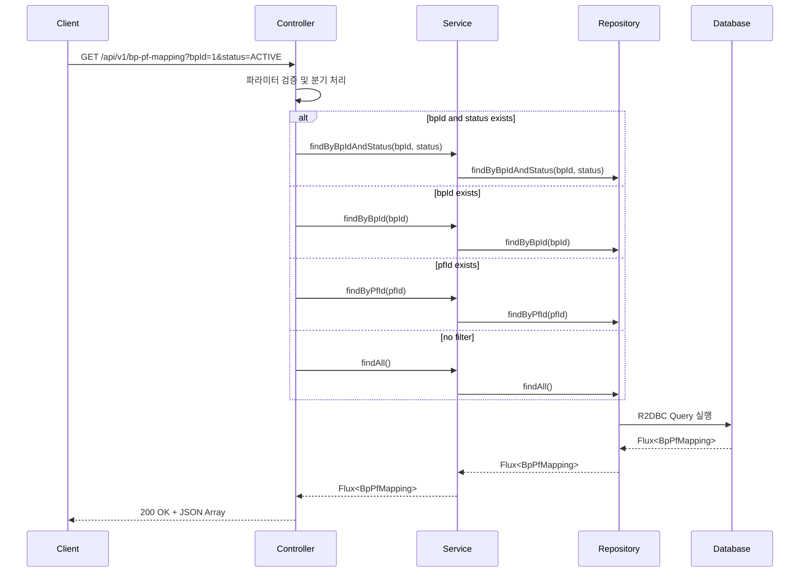
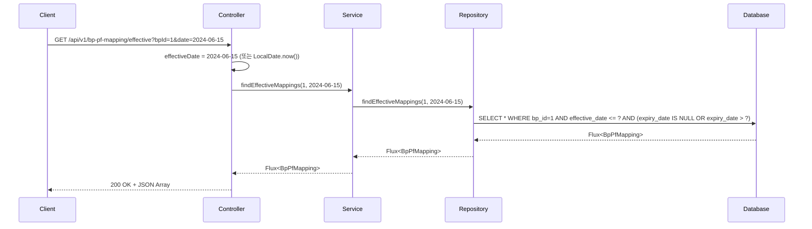
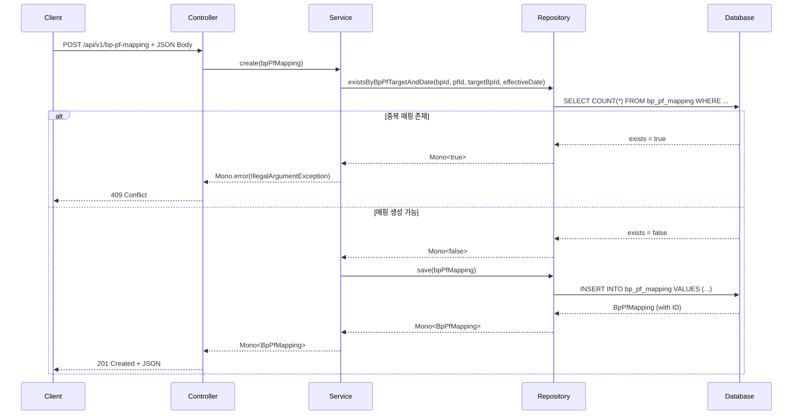
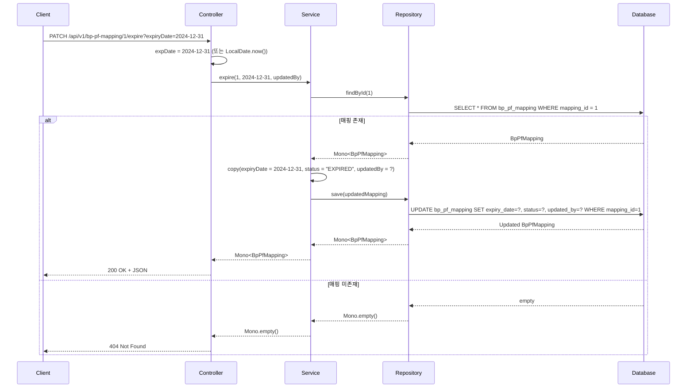

# BP-PF Mapping API 문서

## 개요
Business Partner - Platform Mapping Management API - 비즈니스 파트너와 플랫폼 간 매핑 관계를 관리하는 RESTful API

**Base URL**: `/api/v1/bp-pf-mapping`

## 도메인 모델

### 클래스 다이어그램



## API 엔드포인트

### 1. 전체 매핑 조회
**GET** `/api/v1/bp-pf-mapping`

BP-PF 매핑 목록을 조회하며, 선택적 필터링 지원

#### 요청 파라미터
| 파라미터 | 타입 | 필수 | 설명 | 예시 |
|---------|------|-----|------|------|
| bpId | Long | N | BP ID 필터 | 1 |
| pfId | Long | N | 플랫폼 ID 필터 | 1 |
| status | String | N | 상태 필터 | ACTIVE, EXPIRED |

#### 응답
```json
[
  {
    "mappingId": 1,
    "bpId": 1,
    "pfId": 1,
    "targetBpId": 2,
    "parentBpId": null,
    "effectiveDate": "2024-01-01",
    "expiryDate": "2024-12-31",
    "status": "ACTIVE",
    "mappingType": "FRANCHISE",
    "priority": 1,
    "notes": "Primary franchise mapping",
    "createdDate": "2023-12-20T10:00:00",
    "updatedDate": "2024-01-01T09:00:00",
    "createdBy": "admin",
    "updatedBy": "admin"
  }
]
```

#### API 흐름도


---

### 2. ID로 매핑 조회
**GET** `/api/v1/bp-pf-mapping/{id}`

특정 매핑 ID로 단일 매핑 조회

#### 경로 파라미터
| 파라미터 | 타입 | 필수 | 설명 |
|---------|------|-----|------|
| id | Long | Y | 매핑 고유 ID |

#### 응답
- **200 OK**: 매핑 정보 반환
- **404 Not Found**: 매핑 미존재

---

### 3. BP와 PF 조합으로 매핑 조회
**GET** `/api/v1/bp-pf-mapping/by-bp-pf`

특정 BP와 PF 조합의 매핑 목록 조회

#### 요청 파라미터
| 파라미터 | 타입 | 필수 | 설명 | 예시 |
|---------|------|-----|------|------|
| bpId | Long | Y | BP ID | 1 |
| pfId | Long | Y | 플랫폼 ID | 1 |

---

### 4. Target BP ID로 매핑 조회
**GET** `/api/v1/bp-pf-mapping/by-target/{targetBpId}`

대상 BP를 기준으로 매핑 조회

#### 경로 파라미터
| 파라미터 | 타입 | 필수 | 설명 |
|---------|------|-----|------|
| targetBpId | Long | Y | 대상 BP ID |

---

### 5. Parent BP ID로 매핑 조회
**GET** `/api/v1/bp-pf-mapping/by-parent/{parentBpId}`

상위 BP를 기준으로 매핑 조회

#### 경로 파라미터
| 파라미터 | 타입 | 필수 | 설명 |
|---------|------|-----|------|
| parentBpId | Long | Y | 상위 BP ID |

---

### 6. 특정 날짜 유효한 매핑 조회
**GET** `/api/v1/bp-pf-mapping/effective`

특정 날짜 기준으로 유효한 매핑 조회

#### 요청 파라미터
| 파라미터 | 타입 | 필수 | 설명 | 기본값 |
|---------|------|-----|------|-------|
| bpId | Long | Y | BP ID | - |
| date | LocalDate (ISO) | N | 조회 기준 날짜 | 오늘 |

#### API 흐름도


---

### 7. 매핑 생성
**POST** `/api/v1/bp-pf-mapping`

새로운 BP-PF 매핑 생성

#### 요청 바디
```json
{
  "bpId": 1,
  "pfId": 1,
  "targetBpId": 3,
  "parentBpId": null,
  "effectiveDate": "2024-07-01",
  "expiryDate": "2025-06-30",
  "status": "ACTIVE",
  "mappingType": "PARTNERSHIP",
  "priority": 2,
  "notes": "New partnership mapping"
}
```

#### 응답
- **201 Created**: 매핑 생성 성공
- **400 Bad Request**: 잘못된 요청 데이터
- **409 Conflict**: 매핑 중복

#### API 흐름도


---

### 8. 매핑 수정
**PUT** `/api/v1/bp-pf-mapping/{id}`

기존 매핑 정보 수정

#### 경로 파라미터
| 파라미터 | 타입 | 필수 | 설명 |
|---------|------|-----|------|
| id | Long | Y | 매핑 고유 ID |

---

### 9. 매핑 상태 변경
**PATCH** `/api/v1/bp-pf-mapping/{id}/status`

매핑 상태만 변경

#### 경로 파라미터
| 파라미터 | 타입 | 필수 | 설명 |
|---------|------|-----|------|
| id | Long | Y | 매핑 고유 ID |

#### 요청 파라미터
| 파라미터 | 타입 | 필수 | 설명 | 예시 |
|---------|------|-----|------|------|
| status | String | Y | 새로운 상태 | ACTIVE, EXPIRED |
| updatedBy | String | N | 수정자 | admin |

---

### 10. 매핑 만료 처리
**PATCH** `/api/v1/bp-pf-mapping/{id}/expire`

매핑 만료 처리 (상태 변경 + 만료일 설정)

#### 경로 파라미터
| 파라미터 | 타입 | 필수 | 설명 |
|---------|------|-----|------|
| id | Long | Y | 매핑 고유 ID |

#### 요청 파라미터
| 파라미터 | 타입 | 필수 | 설명 | 기본값 |
|---------|------|-----|------|-------|
| expiryDate | LocalDate (ISO) | N | 만료일 | 오늘 |
| updatedBy | String | N | 수정자 | system |

#### API 흐름도


---

### 11. 매핑 삭제
**DELETE** `/api/v1/bp-pf-mapping/{id}`

매핑 삭제 (영구 삭제)

#### 경로 파라미터
| 파라미터 | 타입 | 필수 | 설명 |
|---------|------|-----|------|
| id | Long | Y | 매핑 고유 ID |

#### 응답
- **204 No Content**: 삭제 성공
- **404 Not Found**: 매핑 미존재

---

### 12. 매핑 중복 체크
**GET** `/api/v1/bp-pf-mapping/check/duplicate`

특정 조건의 매핑 중복 여부 확인

#### 요청 파라미터
| 파라미터 | 타입 | 필수 | 설명 | 예시 |
|---------|------|-----|------|------|
| bpId | Long | Y | BP ID | 1 |
| pfId | Long | Y | 플랫폼 ID | 1 |
| targetBpId | Long | N | 대상 BP ID | 2 |
| effectiveDate | LocalDate (ISO) | Y | 유효 날짜 | 2024-01-01 |

#### 응답
```json
{
  "exists": false
}
```

## 에러 응답

### 공통 에러 코드
| HTTP 상태 | 설명 |
|----------|------|
| 400 Bad Request | 잘못된 요청 데이터 |
| 404 Not Found | 리소스 미존재 |
| 409 Conflict | 데이터 충돌 (중복 등) |
| 500 Internal Server Error | 서버 내부 오류 |

## 비즈니스 규칙

1. **BP-PF 조합 필수**: `bpId`와 `pfId` 모두 필수
2. **유효 날짜 필수**: `effectiveDate`는 필수이며, 미래 날짜 가능
3. **만료일 제약**: `expiryDate`는 `effectiveDate` 이후 날짜만 허용
4. **중복 방지**: 동일한 BP-PF-Target 조합에 대해 기간이 중복되는 매핑 생성 불가
5. **상태 값**: ACTIVE, EXPIRED, SUSPENDED 중 하나만 허용
6. **매핑 유형**: FRANCHISE, PARTNERSHIP, DISTRIBUTOR 등 사전 정의된 값만 허용
7. **우선순위**: `priority`는 1 이상의 정수값, 숫자가 낮을수록 높은 우선순위
8. **삭제 제약**: 활성 상태의 매핑은 만료 처리 후 삭제 권장

## 사용 예시

### cURL 예시

```bash
# BP의 활성 매핑 조회
curl -X GET "http://localhost:8080/api/v1/bp-pf-mapping?bpId=1&status=ACTIVE"

# BP와 PF 조합 매핑 조회
curl -X GET "http://localhost:8080/api/v1/bp-pf-mapping/by-bp-pf?bpId=1&pfId=1"

# 특정 날짜 유효한 매핑 조회
curl -X GET "http://localhost:8080/api/v1/bp-pf-mapping/effective?bpId=1&date=2024-06-15"

# 매핑 생성
curl -X POST "http://localhost:8080/api/v1/bp-pf-mapping" \
  -H "Content-Type: application/json" \
  -d '{
    "bpId": 1,
    "pfId": 1,
    "targetBpId": 3,
    "effectiveDate": "2024-07-01",
    "expiryDate": "2025-06-30",
    "status": "ACTIVE",
    "mappingType": "PARTNERSHIP",
    "priority": 2
  }'

# 매핑 만료 처리
curl -X PATCH "http://localhost:8080/api/v1/bp-pf-mapping/1/expire?expiryDate=2024-12-31&updatedBy=admin"

# 매핑 중복 체크
curl -X GET "http://localhost:8080/api/v1/bp-pf-mapping/check/duplicate?bpId=1&pfId=1&targetBpId=2&effectiveDate=2024-07-01"
```

## 관련 도메인

- **BpMaster**: 매핑에 참여하는 비즈니스 파트너 정보
- **PfCodeMaster**: 매핑 대상 플랫폼 정보
- **BpContractInfo**: 매핑 관련 계약 정보