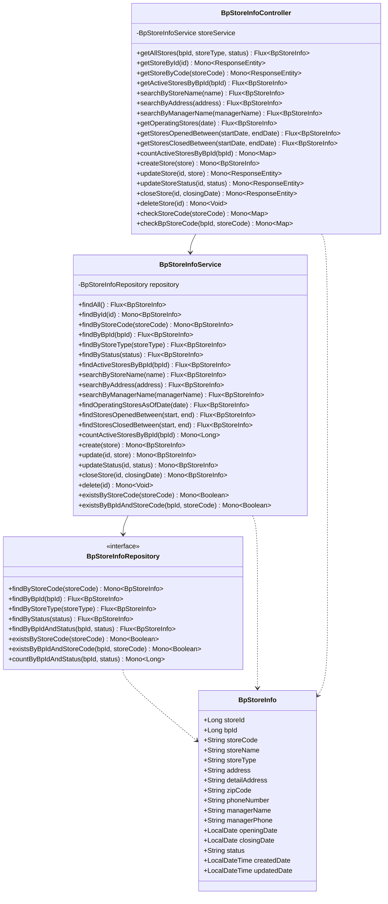
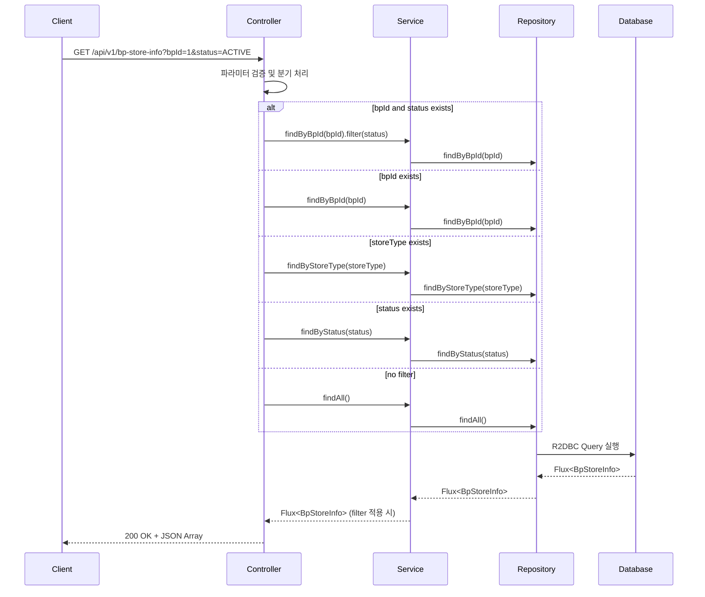
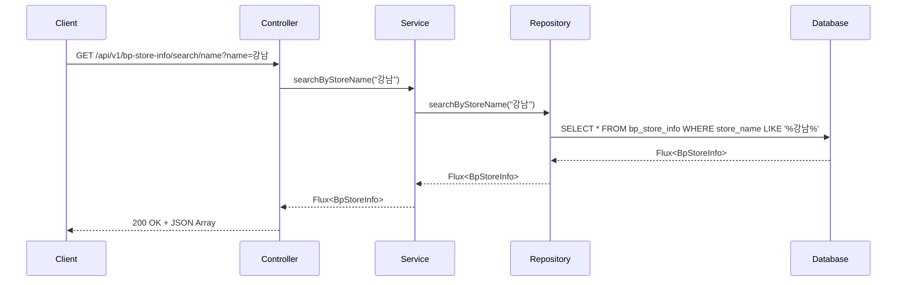
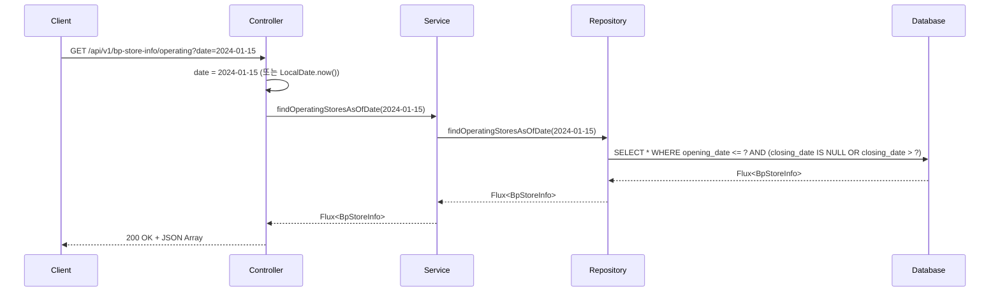
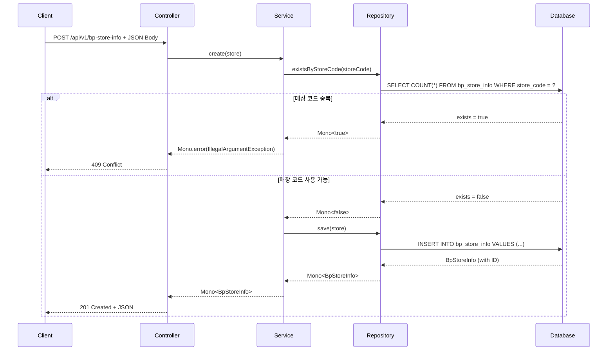
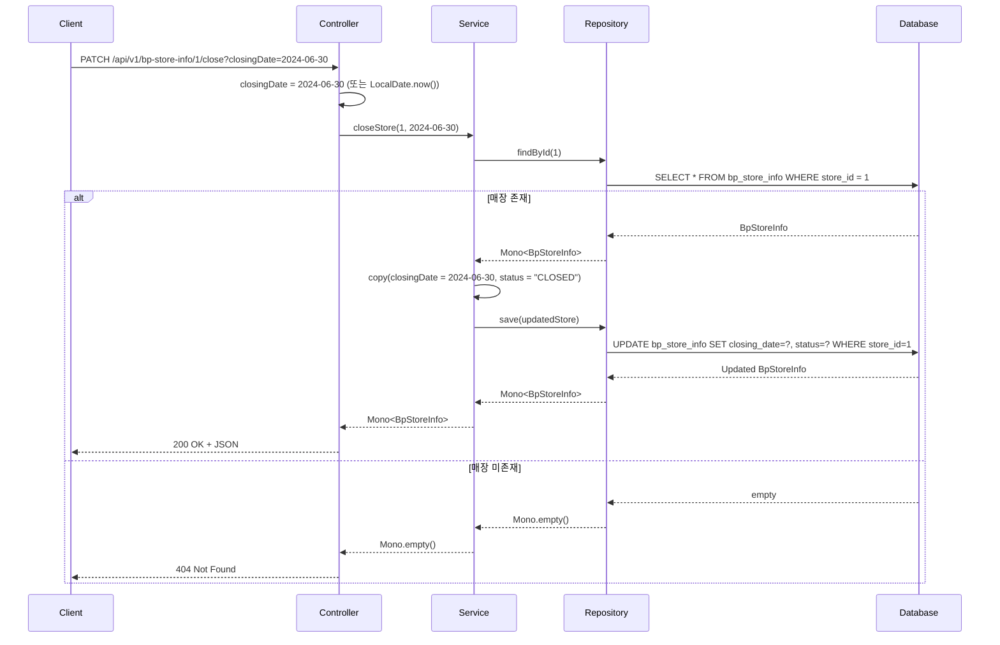

# BP Store Info API 문서

## 개요
Business Partner Store Information Management API - 비즈니스 파트너 소속 매장 정보를 관리하는 RESTful API

**Base URL**: `/api/v1/bp-store-info`

## 도메인 모델

### 클래스 다이어그램



## API 엔드포인트

### 1. 전체 매장 조회
**GET** `/api/v1/bp-store-info`

매장 목록을 조회하며, 선택적 필터링 지원

#### 요청 파라미터
| 파라미터 | 타입 | 필수 | 설명 | 예시 |
|---------|------|-----|------|------|
| bpId | Long | N | BP ID 필터 | 1 |
| storeType | String | N | 매장 유형 필터 | FLAGSHIP, BRANCH |
| status | String | N | 상태 필터 | ACTIVE, CLOSED |

#### 응답
```json
[
  {
    "storeId": 1,
    "bpId": 1,
    "storeCode": "ST001",
    "storeName": "강남 본점",
    "storeType": "FLAGSHIP",
    "address": "서울시 강남구 테헤란로 123",
    "detailAddress": "3층",
    "zipCode": "06234",
    "phoneNumber": "02-1234-5678",
    "managerName": "김매니저",
    "managerPhone": "010-1234-5678",
    "openingDate": "2020-01-01",
    "closingDate": null,
    "status": "ACTIVE",
    "createdDate": "2024-01-01T10:00:00",
    "updatedDate": "2024-01-15T14:30:00"
  }
]
```

#### API 흐름도


---

### 2. ID로 매장 조회
**GET** `/api/v1/bp-store-info/{id}`

특정 매장 ID로 단일 매장 조회

#### 경로 파라미터
| 파라미터 | 타입 | 필수 | 설명 |
|---------|------|-----|------|
| id | Long | Y | 매장 고유 ID |

#### 응답
- **200 OK**: 매장 정보 반환
- **404 Not Found**: 매장 미존재

---

### 3. 매장 코드로 조회
**GET** `/api/v1/bp-store-info/code/{storeCode}`

매장 코드로 단일 매장 조회

#### 경로 파라미터
| 파라미터 | 타입 | 필수 | 설명 |
|---------|------|-----|------|
| storeCode | String | Y | 매장 코드 |

---

### 4. BP의 활성 매장 조회
**GET** `/api/v1/bp-store-info/active/by-bp/{bpId}`

특정 BP의 활성 상태 매장만 조회

#### 경로 파라미터
| 파라미터 | 타입 | 필수 | 설명 |
|---------|------|-----|------|
| bpId | Long | Y | BP ID |

---

### 5. 매장명으로 검색
**GET** `/api/v1/bp-store-info/search/name`

매장명으로 부분 일치 검색

#### 요청 파라미터
| 파라미터 | 타입 | 필수 | 설명 | 예시 |
|---------|------|-----|------|------|
| name | String | Y | 검색할 매장명 | 강남 |

#### API 흐름도


---

### 6. 주소로 검색
**GET** `/api/v1/bp-store-info/search/address`

주소로 부분 일치 검색

#### 요청 파라미터
| 파라미터 | 타입 | 필수 | 설명 | 예시 |
|---------|------|-----|------|------|
| address | String | Y | 검색할 주소 | 서울시 |

---

### 7. 매니저명으로 검색
**GET** `/api/v1/bp-store-info/search/manager`

매니저명으로 부분 일치 검색

#### 요청 파라미터
| 파라미터 | 타입 | 필수 | 설명 | 예시 |
|---------|------|-----|------|------|
| managerName | String | Y | 검색할 매니저명 | 김 |

---

### 8. 특정 날짜 운영 중인 매장 조회
**GET** `/api/v1/bp-store-info/operating`

특정 날짜 기준으로 운영 중인 매장 조회

#### 요청 파라미터
| 파라미터 | 타입 | 필수 | 설명 | 기본값 |
|---------|------|-----|------|-------|
| date | LocalDate (ISO) | N | 조회 기준 날짜 | 오늘 |

#### 응답
```json
[
  {
    "storeId": 1,
    "storeName": "강남 본점",
    "openingDate": "2020-01-01",
    "closingDate": null,
    "status": "ACTIVE"
  }
]
```

#### API 흐름도


---

### 9. 기간 내 개점한 매장 조회
**GET** `/api/v1/bp-store-info/opened-between`

특정 기간 내에 개점한 매장 조회

#### 요청 파라미터
| 파라미터 | 타입 | 필수 | 설명 | 예시 |
|---------|------|-----|------|------|
| startDate | LocalDate (ISO) | Y | 시작일 | 2024-01-01 |
| endDate | LocalDate (ISO) | Y | 종료일 | 2024-12-31 |

---

### 10. 기간 내 폐점한 매장 조회
**GET** `/api/v1/bp-store-info/closed-between`

특정 기간 내에 폐점한 매장 조회

#### 요청 파라미터
| 파라미터 | 타입 | 필수 | 설명 | 예시 |
|---------|------|-----|------|------|
| startDate | LocalDate (ISO) | Y | 시작일 | 2024-01-01 |
| endDate | LocalDate (ISO) | Y | 종료일 | 2024-12-31 |

---

### 11. BP의 활성 매장 수 조회
**GET** `/api/v1/bp-store-info/count/active/{bpId}`

특정 BP의 활성 매장 개수 조회

#### 경로 파라미터
| 파라미터 | 타입 | 필수 | 설명 |
|---------|------|-----|------|
| bpId | Long | Y | BP ID |

#### 응답
```json
{
  "activeStoreCount": 5
}
```

---

### 12. 매장 생성
**POST** `/api/v1/bp-store-info`

새로운 매장 생성

#### 요청 바디
```json
{
  "bpId": 1,
  "storeCode": "ST002",
  "storeName": "서초 지점",
  "storeType": "BRANCH",
  "address": "서울시 서초구 서초대로 456",
  "detailAddress": "1층",
  "zipCode": "06590",
  "phoneNumber": "02-9876-5432",
  "managerName": "이매니저",
  "managerPhone": "010-9876-5432",
  "openingDate": "2024-01-15",
  "status": "ACTIVE"
}
```

#### 응답
- **201 Created**: 매장 생성 성공
- **400 Bad Request**: 잘못된 요청 데이터
- **409 Conflict**: 매장 코드 중복

#### API 흐름도


---

### 13. 매장 수정
**PUT** `/api/v1/bp-store-info/{id}`

기존 매장 정보 수정

#### 경로 파라미터
| 파라미터 | 타입 | 필수 | 설명 |
|---------|------|-----|------|
| id | Long | Y | 매장 고유 ID |

---

### 14. 매장 상태 변경
**PATCH** `/api/v1/bp-store-info/{id}/status`

매장 상태만 변경

#### 경로 파라미터
| 파라미터 | 타입 | 필수 | 설명 |
|---------|------|-----|------|
| id | Long | Y | 매장 고유 ID |

#### 요청 파라미터
| 파라미터 | 타입 | 필수 | 설명 | 예시 |
|---------|------|-----|------|------|
| status | String | Y | 새로운 상태 | ACTIVE, CLOSED |

---

### 15. 매장 폐점 처리
**PATCH** `/api/v1/bp-store-info/{id}/close`

매장 폐점 처리 (상태 변경 + 폐점일 설정)

#### 경로 파라미터
| 파라미터 | 타입 | 필수 | 설명 |
|---------|------|-----|------|
| id | Long | Y | 매장 고유 ID |

#### 요청 파라미터
| 파라미터 | 타입 | 필수 | 설명 | 기본값 |
|---------|------|-----|------|-------|
| closingDate | LocalDate (ISO) | N | 폐점일 | 오늘 |

#### API 흐름도


---

### 16. 매장 삭제
**DELETE** `/api/v1/bp-store-info/{id}`

매장 삭제 (영구 삭제)

#### 경로 파라미터
| 파라미터 | 타입 | 필수 | 설명 |
|---------|------|-----|------|
| id | Long | Y | 매장 고유 ID |

#### 응답
- **204 No Content**: 삭제 성공
- **404 Not Found**: 매장 미존재

---

### 17. 매장 코드 중복 체크
**GET** `/api/v1/bp-store-info/check/code/{storeCode}`

매장 코드 중복 여부 확인

#### 경로 파라미터
| 파라미터 | 타입 | 필수 | 설명 | 예시 |
|---------|------|-----|------|------|
| storeCode | String | Y | 매장 코드 | ST001 |

#### 응답
```json
{
  "exists": true
}
```

---

### 18. BP별 매장 코드 중복 체크
**GET** `/api/v1/bp-store-info/check/bp-store`

특정 BP 내에서 매장 코드 중복 여부 확인

#### 요청 파라미터
| 파라미터 | 타입 | 필수 | 설명 | 예시 |
|---------|------|-----|------|------|
| bpId | Long | Y | BP ID | 1 |
| storeCode | String | Y | 매장 코드 | ST001 |

#### 응답
```json
{
  "exists": false
}
```

## 에러 응답

### 공통 에러 코드
| HTTP 상태 | 설명 |
|----------|------|
| 400 Bad Request | 잘못된 요청 데이터 |
| 404 Not Found | 리소스 미존재 |
| 409 Conflict | 데이터 충돌 (중복 등) |
| 500 Internal Server Error | 서버 내부 오류 |

## 비즈니스 규칙

1. **매장 코드 고유성**: `storeCode`는 시스템 전체에서 고유해야 함
2. **BP 연관 필수**: 모든 매장은 반드시 하나의 BP에 속해야 함
3. **상태 값**: ACTIVE, CLOSED, SUSPENDED 중 하나만 허용
4. **개점일 필수**: `openingDate`는 필수이며, 미래 날짜 가능
5. **폐점일 제약**: `closingDate`는 `openingDate` 이후 날짜만 허용
6. **삭제 제약**: 거래 이력이 있는 매장은 삭제 불가 (폐점 처리 권장)

## 사용 예시

### cURL 예시

```bash
# BP의 활성 매장 조회
curl -X GET "http://localhost:8080/api/v1/bp-store-info?bpId=1&status=ACTIVE"

# 매장명 검색
curl -X GET "http://localhost:8080/api/v1/bp-store-info/search/name?name=강남"

# 운영 중인 매장 조회 (오늘 기준)
curl -X GET "http://localhost:8080/api/v1/bp-store-info/operating"

# 매장 생성
curl -X POST "http://localhost:8080/api/v1/bp-store-info" \
  -H "Content-Type: application/json" \
  -d '{
    "bpId": 1,
    "storeCode": "ST002",
    "storeName": "서초 지점",
    "storeType": "BRANCH",
    "address": "서울시 서초구 서초대로 456",
    "phoneNumber": "02-9876-5432",
    "managerName": "이매니저",
    "openingDate": "2024-01-15",
    "status": "ACTIVE"
  }'

# 매장 폐점 처리
curl -X PATCH "http://localhost:8080/api/v1/bp-store-info/1/close?closingDate=2024-06-30"

# BP의 활성 매장 수 조회
curl -X GET "http://localhost:8080/api/v1/bp-store-info/count/active/1"
```

## 관련 도메인

- **BpMaster**: 매장을 소유한 비즈니스 파트너 정보
- **BpContractInfo**: 매장 관련 계약 정보