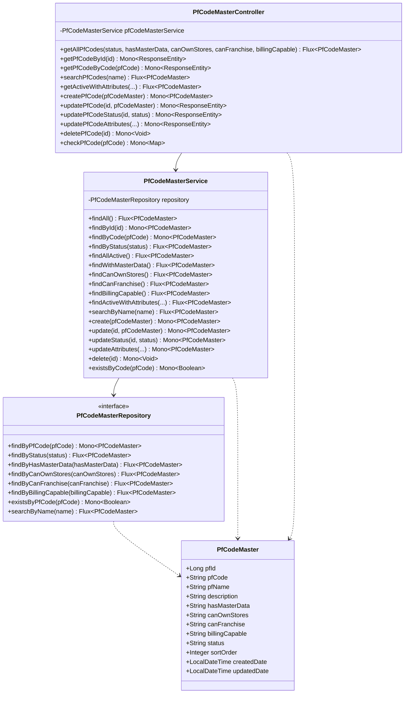
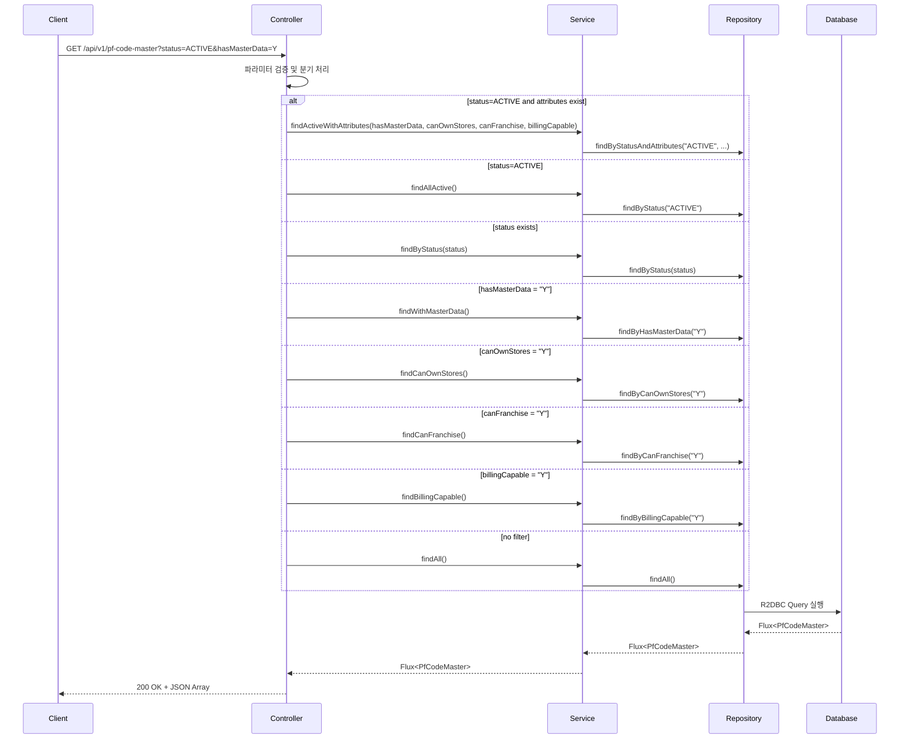
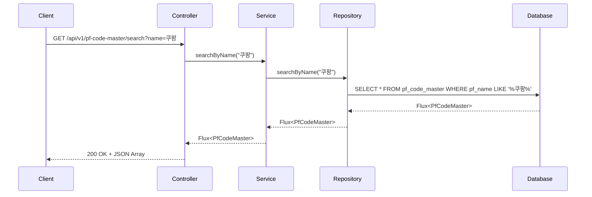
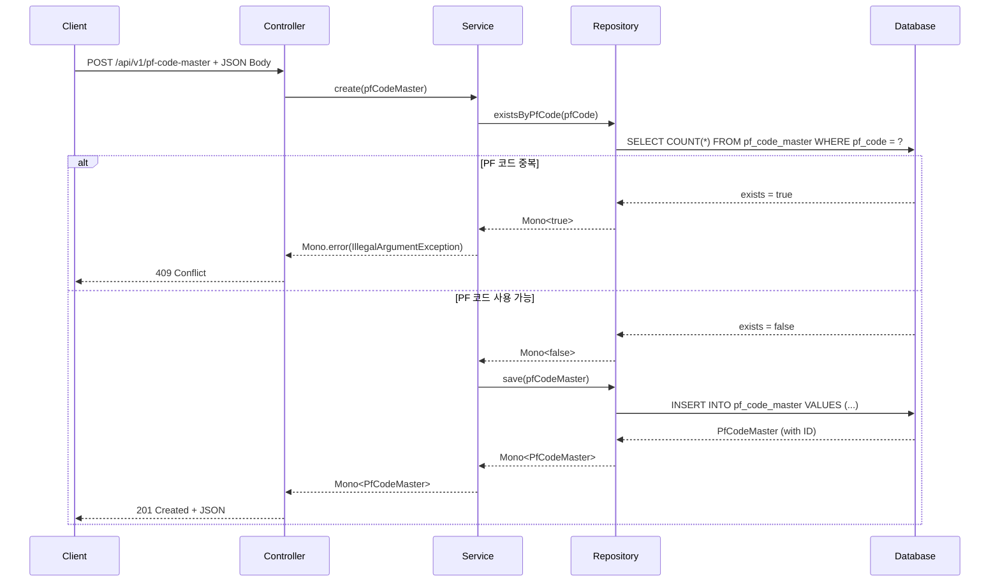
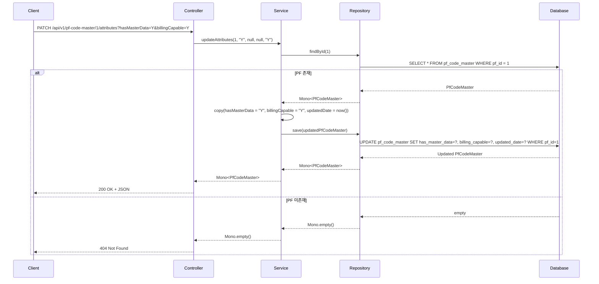

# PF Code Master API 문서

## 개요
Platform Code Master Data Management API - 플랫폼 코드 마스터 데이터를 관리하는 RESTful API

**Base URL**: `/api/v1/pf-code-master`

## 도메인 모델

### 클래스 다이어그램



## API 엔드포인트

### 1. 전체 PF 코드 조회
**GET** `/api/v1/pf-code-master`

플랫폼 코드 목록을 조회하며, 선택적 필터링 지원

#### 요청 파라미터
| 파라미터 | 타입 | 필수 | 설명 | 예시 |
|---------|------|-----|------|------|
| status | String | N | 상태 필터 | ACTIVE, INACTIVE |
| hasMasterData | String | N | 마스터 데이터 보유 여부 | Y, N |
| canOwnStores | String | N | 매장 소유 가능 여부 | Y, N |
| canFranchise | String | N | 프랜차이즈 가능 여부 | Y, N |
| billingCapable | String | N | 과금 가능 여부 | Y, N |

#### 응답
```json
[
  {
    "pfId": 1,
    "pfCode": "PF001",
    "pfName": "쿠팡이츠",
    "description": "배달 플랫폼",
    "hasMasterData": "Y",
    "canOwnStores": "Y",
    "canFranchise": "Y",
    "billingCapable": "Y",
    "status": "ACTIVE",
    "sortOrder": 1,
    "createdDate": "2023-12-01T10:00:00",
    "updatedDate": "2024-01-01T09:00:00"
  }
]
```

#### API 흐름도


---

### 2. ID로 PF 코드 조회
**GET** `/api/v1/pf-code-master/{id}`

특정 PF ID로 단일 플랫폼 코드 조회

#### 경로 파라미터
| 파라미터 | 타입 | 필수 | 설명 |
|---------|------|-----|------|
| id | Long | Y | PF 고유 ID |

#### 응답
- **200 OK**: PF 정보 반환
- **404 Not Found**: PF 미존재

---

### 3. PF 코드로 조회
**GET** `/api/v1/pf-code-master/code/{pfCode}`

PF 코드로 단일 플랫폼 코드 조회

#### 경로 파라미터
| 파라미터 | 타입 | 필수 | 설명 |
|---------|------|-----|------|
| pfCode | String | Y | PF 코드 |

---

### 4. PF 이름으로 검색
**GET** `/api/v1/pf-code-master/search`

PF 이름으로 부분 일치 검색

#### 요청 파라미터
| 파라미터 | 타입 | 필수 | 설명 | 예시 |
|---------|------|-----|------|------|
| name | String | Y | 검색할 PF 이름 | 쿠팡 |

#### API 흐름도


---

### 5. 특정 속성을 가진 활성 PF 조회
**GET** `/api/v1/pf-code-master/active/with-attributes`

특정 속성을 가진 활성 PF만 조회

#### 요청 파라미터
| 파라미터 | 타입 | 필수 | 설명 | 예시 |
|---------|------|-----|------|------|
| hasMasterData | String | N | 마스터 데이터 보유 | Y |
| canOwnStores | String | N | 매장 소유 가능 | Y |
| canFranchise | String | N | 프랜차이즈 가능 | Y |
| billingCapable | String | N | 과금 가능 | Y |

---

### 6. PF 코드 생성
**POST** `/api/v1/pf-code-master`

새로운 플랫폼 코드 생성

#### 요청 바디
```json
{
  "pfCode": "PF002",
  "pfName": "배달의민족",
  "description": "국내 1위 배달 플랫폼",
  "hasMasterData": "Y",
  "canOwnStores": "Y",
  "canFranchise": "Y",
  "billingCapable": "Y",
  "status": "ACTIVE",
  "sortOrder": 2
}
```

#### 응답
- **201 Created**: PF 생성 성공
- **400 Bad Request**: 잘못된 요청 데이터
- **409 Conflict**: PF 코드 중복

#### API 흐름도


---

### 7. PF 코드 수정
**PUT** `/api/v1/pf-code-master/{id}`

기존 플랫폼 코드 정보 수정

#### 경로 파라미터
| 파라미터 | 타입 | 필수 | 설명 |
|---------|------|-----|------|
| id | Long | Y | PF 고유 ID |

---

### 8. PF 코드 상태 변경
**PATCH** `/api/v1/pf-code-master/{id}/status`

PF 상태만 변경

#### 경로 파라미터
| 파라미터 | 타입 | 필수 | 설명 |
|---------|------|-----|------|
| id | Long | Y | PF 고유 ID |

#### 요청 파라미터
| 파라미터 | 타입 | 필수 | 설명 | 예시 |
|---------|------|-----|------|------|
| status | String | Y | 새로운 상태 | ACTIVE, INACTIVE |

---

### 9. PF 코드 속성 업데이트
**PATCH** `/api/v1/pf-code-master/{id}/attributes`

PF 속성만 선택적으로 업데이트

#### 경로 파라미터
| 파라미터 | 타입 | 필수 | 설명 |
|---------|------|-----|------|
| id | Long | Y | PF 고유 ID |

#### 요청 파라미터
| 파라미터 | 타입 | 필수 | 설명 | 예시 |
|---------|------|-----|------|------|
| hasMasterData | String | N | 마스터 데이터 보유 | Y, N |
| canOwnStores | String | N | 매장 소유 가능 | Y, N |
| canFranchise | String | N | 프랜차이즈 가능 | Y, N |
| billingCapable | String | N | 과금 가능 | Y, N |

#### API 흐름도


---

### 10. PF 코드 삭제
**DELETE** `/api/v1/pf-code-master/{id}`

플랫폼 코드 삭제 (영구 삭제)

#### 경로 파라미터
| 파라미터 | 타입 | 필수 | 설명 |
|---------|------|-----|------|
| id | Long | Y | PF 고유 ID |

#### 응답
- **204 No Content**: 삭제 성공
- **404 Not Found**: PF 미존재
- **409 Conflict**: 의존 관계가 있어 삭제 불가

---

### 11. PF 코드 중복 체크
**GET** `/api/v1/pf-code-master/check/code/{pfCode}`

PF 코드 중복 여부 확인

#### 경로 파라미터
| 파라미터 | 타입 | 필수 | 설명 | 예시 |
|---------|------|-----|------|------|
| pfCode | String | Y | PF 코드 | PF001 |

#### 응답
```json
{
  "exists": true
}
```

## 에러 응답

### 공통 에러 코드
| HTTP 상태 | 설명 |
|----------|------|
| 400 Bad Request | 잘못된 요청 데이터 |
| 404 Not Found | 리소스 미존재 |
| 409 Conflict | 데이터 충돌 (중복 등) |
| 500 Internal Server Error | 서버 내부 오류 |

## 비즈니스 규칙

1. **PF 코드 고유성**: `pfCode`는 시스템 전체에서 고유해야 함
2. **상태 값**: ACTIVE, INACTIVE 중 하나만 허용
3. **속성 값**: Y, N 중 하나만 허용 (hasMasterData, canOwnStores, canFranchise, billingCapable)
4. **정렬 순서**: `sortOrder`는 1 이상의 정수값, 숫자가 낮을수록 높은 우선순위
5. **삭제 제약**: 다른 엔티티(BP, 계약 등)에서 참조 중인 PF는 삭제 불가
6. **필수 속성**: `pfCode`, `pfName`, `status`는 필수

## 사용 예시

### cURL 예시

```bash
# 활성 PF 코드 조회
curl -X GET "http://localhost:8080/api/v1/pf-code-master?status=ACTIVE"

# 마스터 데이터를 가진 활성 PF 조회
curl -X GET "http://localhost:8080/api/v1/pf-code-master?status=ACTIVE&hasMasterData=Y"

# 특정 속성을 가진 활성 PF 조회
curl -X GET "http://localhost:8080/api/v1/pf-code-master/active/with-attributes?hasMasterData=Y&billingCapable=Y"

# PF 이름 검색
curl -X GET "http://localhost:8080/api/v1/pf-code-master/search?name=쿠팡"

# PF 코드 생성
curl -X POST "http://localhost:8080/api/v1/pf-code-master" \
  -H "Content-Type: application/json" \
  -d '{
    "pfCode": "PF002",
    "pfName": "배달의민족",
    "description": "국내 1위 배달 플랫폼",
    "hasMasterData": "Y",
    "canOwnStores": "Y",
    "canFranchise": "Y",
    "billingCapable": "Y",
    "status": "ACTIVE",
    "sortOrder": 2
  }'

# PF 속성 업데이트
curl -X PATCH "http://localhost:8080/api/v1/pf-code-master/1/attributes?hasMasterData=Y&billingCapable=Y"

# PF 코드 중복 체크
curl -X GET "http://localhost:8080/api/v1/pf-code-master/check/code/PF001"
```

## 관련 도메인

- **BpMaster**: PF를 주 플랫폼으로 사용하는 비즈니스 파트너 정보
- **BpPfMapping**: BP와 PF 간 매핑 관계
- **BpContractInfo**: PF를 통한 계약 정보